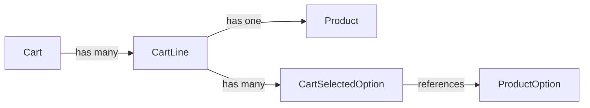

# modular_cart_core

A headless Dart cart engine for configurable products with option/modifier support and deterministic cart line identity.

`modular_cart_core` is immutable by design and focused on predictable pricing and merge behavior.

## Features

- Immutable models (`Cart`, `CartLine`, `CartSelectedOption`, `Product`, `ProductOption`).
- Configurable products with option-level quantities.
- Automatic normalization of options inside a `CartLine`:
  - duplicate option IDs are merged
  - option quantities are summed
  - options are sorted by option ID for stable identity
- Deterministic cart merge behavior:
  - `Cart.withAddedLine` merges only when line identity matches
  - line quantity is incremented on merge
- Built-in debug formatter via `CartDebug.getString()`.
- UI-agnostic and storage-agnostic core domain layer.

## Installation

### Prerequisites

- Dart SDK `^3.10.4`

### Add dependency

If using this repository directly:

```yaml
dependencies:
  modular_cart_core:
    git:
      url: https://github.com/winnrz/modular_cart_core.git
```

Then run:

```bash
dart pub get
```

## Usage

Full runnable example: [`example/modular_cart_core_example.dart`](example/modular_cart_core_example.dart)

```dart
import 'package:modular_cart_core/modular_cart_core.dart';

void main() {
  final rice = Product(id: 'rice', price: 10, metadata: {'name': 'Rice'});

  final eggs = ProductOption(id: 'eggs', price: 2, metadata: {'name': 'Eggs'});
  final bacon = ProductOption(id: 'bacon', price: 3, metadata: {'name': 'Bacon'});

  final line = CartLine(
    product: rice,
    selectedOptions: [
      CartSelectedOption(option: eggs, quantity: 2),
      CartSelectedOption(option: eggs, quantity: 3),
      CartSelectedOption(option: bacon, quantity: 1),
    ],
    quantity: 1,
  );

  final cart = Cart().withAddedLine(line);

  print(cart.getString());
  print('Cart total: ${cart.totalPrice}');
}
```

Expected output from `cart.getString()`:

```text
Cart contents:
-------------------------
Product: rice
  Base price: 10.0
  Quantity: 1
  Options:
    bacon - quantity: 1, unit price: 3.0, total: 3.0
    eggs - quantity: 5, unit price: 2.0, total: 10.0
  Line subtotal: 23.0
-------------------------
Cart total: 23.0
```

## Core API

- `Product`: base product identity (`id`) and price.
- `ProductOption`: option identity (`id`) and price.
- `CartSelectedOption`: selected option + quantity within a line.
- `CartLine`: one product selection with normalized selected options and line quantity.
- `Cart`:
  - `withAddedLine(CartLine line)`
  - `withRemovedLineQuantity(CartLine line, int delta)`
  - `totalPrice`
- `CartDebug` extension:
  - `getString()` for detailed debug output.

## Data Model



## Merge Rules

- `CartLine` equality is based on:
  - `product`
  - normalized `selectedOptions`
- `CartLine.quantity` is not part of equality.
- `CartSelectedOption` equality includes:
  - `option`
  - `quantity`
- Because of this, two lines with the same product but different option quantities are treated as different lines.

## Contributing
Contributions are welcome!
1. Fork the repository.
2. Create a branch: `git checkout -b feature/my-feature`.
3. Make your changes.
4. Run tests: `dart test`.
5. Open a pull request.

## Issues

Please open issues at:

- https://github.com/winnrz/modular_cart_core/issues

## License

MIT License.
